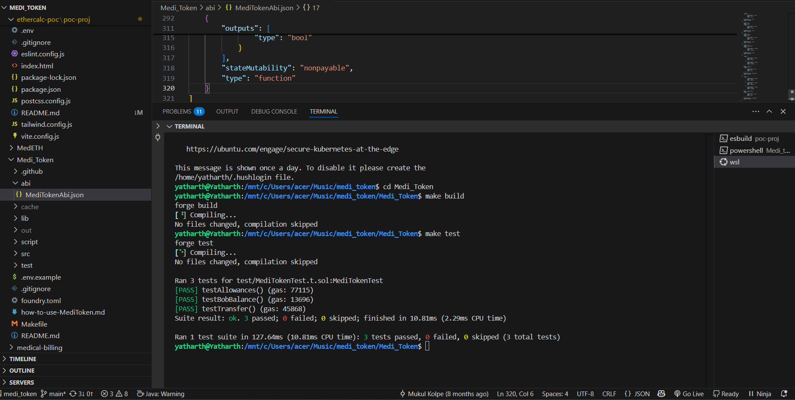
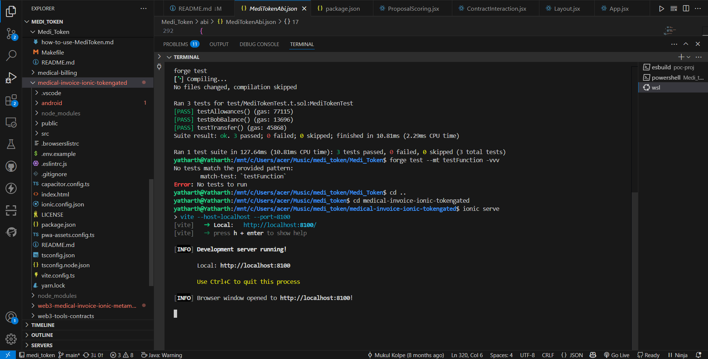
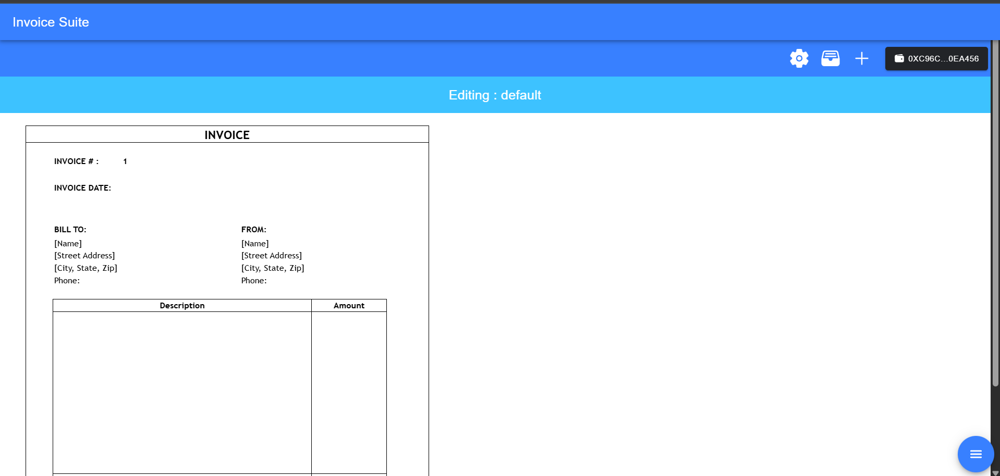
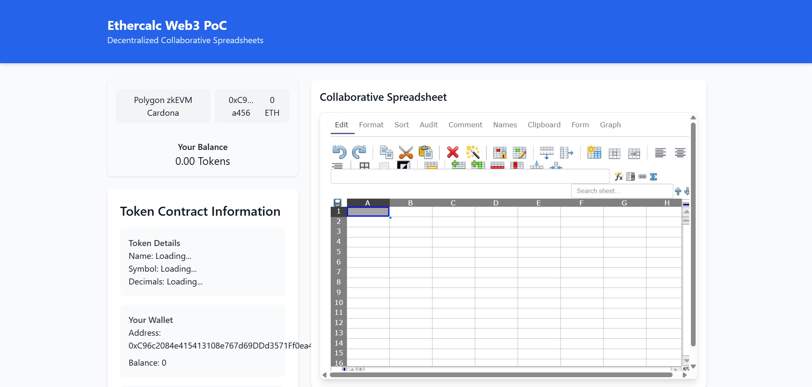
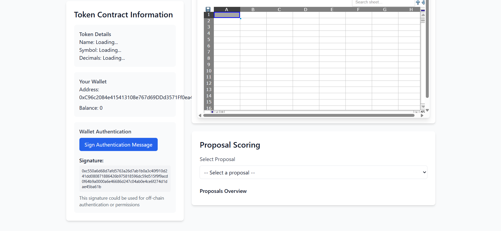

# 🌐 Web3Calc: Decentralized Collaborative Spreadsheets

[](https://reactjs.org/)
[](https://docs.ethers.org/v6/)
[](https://ethercalc.net/)


> A Web3-powered proof of concept demonstrating decentralized collaboration through token-gated Ethercalc integration.

## 📋 Prerequisites & Dependencies 

Before setting up the main project, you'll need to install and run two core modules:

### 1. Medi_Token Module Setup

The Medi_Token module provides the ERC-20 token contract used for access control. We have successfully tested the module with the following results:


This verifies that our token implementation correctly handles:
- Token allowances
- Balance checking
- Transfer functionality

To replicate these test results:

```bash
cd Medi_Token
make build   # Uses forge build
make test    # Uses forge test
```



The successful test results confirm our token contract is ready for integration with the Ethercalc system.

### 2. Medical Invoice Ionic Module Setup

This module provides the token-gated invoice interface:

```bash
cd ../medical-invoice-ionic-tokengated

# Install dependencies
npm install

# Serve the application
ionic serve
```

The application should be available at `http://localhost:8100`

### Screenshots & Demo

For visual reference of the working modules:




- 🏆 **Challenge Completed**: Successfully implemented token-gated access control and collaborative spreadsheet functionality
- 🎥 **Demo Video**: A walkthrough of the complete system is available at [Demo Link](your-demo-link) will be updated soon . 

---

## 🎯 Project Overview

Web3Calc reimagines collaborative spreadsheets by combining the power of Web3 with Ethercalc's real-time editing capabilities. This PoC demonstrates how decentralized identity and token-based permissions can enhance collaborative data management while maintaining the familiar spreadsheet interface.

### Key Features
- 🔑 Web3 wallet integration for secure authentication
- 💰 Token-gated access control using MediToken (ERC-20)
- 📝 Real-time collaborative spreadsheet editing
- ✍️ Off-chain signing for gas-less permissions
- 🗳️ On-chain voting/scoring system integrated with spreadsheet data

## 🚀 Getting Started

### Prerequisites
- Node.js 16+
- npm or yarn
- A Web3 wallet (MetaMask recommended)
- MediTokens for testing permissions

### Installation

1. Clone the repository
git clone https://github.com/yatharth-tripathi/ZKMedical-Billing/tree/main/ethercalc-poc/
cd poc-proj

2. Install dependencies
npm install


3. Create .env file
```env
VITE_ETHERCALC_URL=https://ethercalc.net
VITE_ETHERCALC_SHEET_ID=your_sheet_id
VITE_CONTRACT_ADDRESS=your_contract_address
VITE_ALCHEMY_ID=your_alchemy_id
VITE_WALLETCONNECT_PROJECT_ID=your_project_id
```

4. Start the development server
\`\`\`
npm run dev
```

## 💡 Approach & Architecture

### Technical Stack
- **Frontend**: React + Vite
- **Web3**: RainbowKit, wagmi, ethers.js
- **Styling**: TailwindCSS
- **Collaborative Editing**: Ethercalc
- **Smart Contracts**: MediToken (ERC-20)

### Integration Flow
1. Users connect their Web3 wallet
2. Token balances determine access levels
3. Off-chain signatures validate permissions
4. Real-time spreadsheet updates sync with on-chain data
5. Token transfers enable voting/scoring mechanisms

## 🔧 Modules Integration

### MediToken Integration
We leveraged the MediToken module from the ZKMedical-Billing repository to handle:
- Token-based access control
- On-chain voting mechanisms
- Permission validation




(../poc-proj/screenshots/ethercalc.png)

(../poc-proj/screenshots/local.png)


(../poc-proj/screenshots/proposallist.png)


### Web3 Features

#### Smart Contract Interaction
- Direct token transfers
- Balance checking
- Event listening for updates

#### Off-chain Signing (EIP-712)
- Gas-less permission validation
- Secure action authorization
- Efficient user experience


#### Token Gating
- Granular access control
- Role-based permissions
- Dynamic privilege management

## 🔄 Ethercalc Integration

### Features
- Real-time collaborative editing
- Web3 wallet-based authentication
- Token-gated cell editing
- On-chain data synchronization

### Permission Logic
```javascript
if (userHasTokens >= requiredAmount) {
    allowEdit(cellRange);
} else {
    readOnlyAccess(cellRange);
}
```

## 🔮 Future Scope

### Planned Improvements
1. Full on-chain data synchronization
2. DAO integration for governance
3. ZK-proof based permissioning
4. Multi-chain support
5. Enhanced token utility mechanisms

### Potential Applications
- Decentralized grant management
- DAO treasury tracking
- Community-driven scoring systems
- Token-gated collaborative workspaces

## 📄 License

This project is licensed under the MIT License - see the [LICENSE](LICENSE) file for details.

---
*Built with ❤️ for C4GT 2025*
